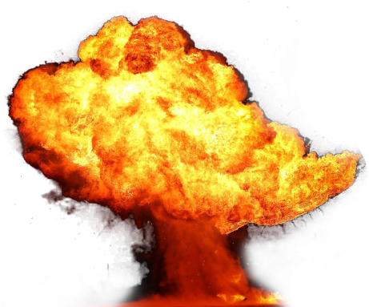
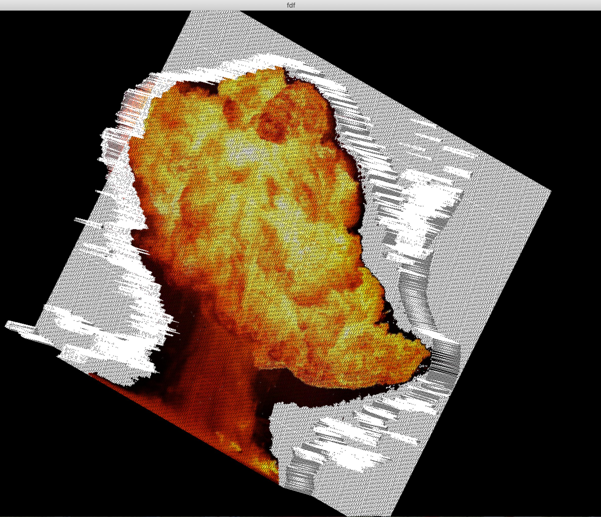

# pngtofdf-42
<🔸><🔸><🔸><🔸><🔸><🔸><🔸><🔸> ALPHABEN <🔸><🔸><🔸><🔸><🔸><🔸><🔸><🔸>
# note
1- run program you must install java  
2- it btter if it is  a image without a background  
3- run program us : java Main path_of_image > path_of_file  
4 - if want test you image us "./fdf path_of_file" [fdf create by phobos: https://github.com/pho8os/FdF-42
========================================================
#  <<<<<<<<<<<<<<<<<<<<<< mpas >>>>>>>>>>>>>>>>>>>>>>>>>>>

<h1> fdf View <h1>

<a href ="./map/fire.fdf" > ❇️❇️❇️ Fire Map </a>
========================
========================

<h1> fdf View <h1>

<a href ="./map/mahdi.fdf" > ❇️❇️❇️ Mahdi Map </a>

========================
========================

<h1> fdf View <h1>

<a href ="./map/rca.fdf" > ❇️❇️❇️ Rca Map </a>

# and more maps in map directory
